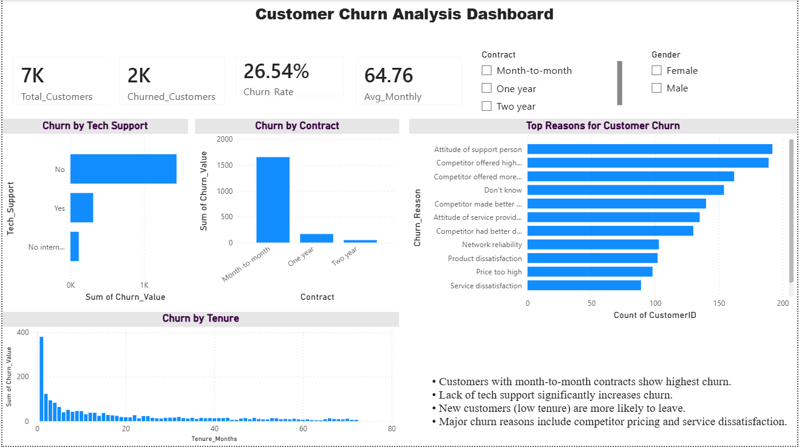

# Customer Churn Analysis

## Project Overview

This project analyzes customer churn behavior to identify key factors influencing customer retention.

## Tools Used

* SQL (Data Cleaning & Analysis)
* Python (Pandas, Seaborn for EDA)
* Power BI (Dashboard Visualization)

## Key Insights

* Month-to-month contracts have highest churn
* Customers with no tech support churn more
* High monthly charges increase churn
* Top reasons: competitor pricing & service issues

## Dashboard Preview

## Author

MARADA DHARANIJA

